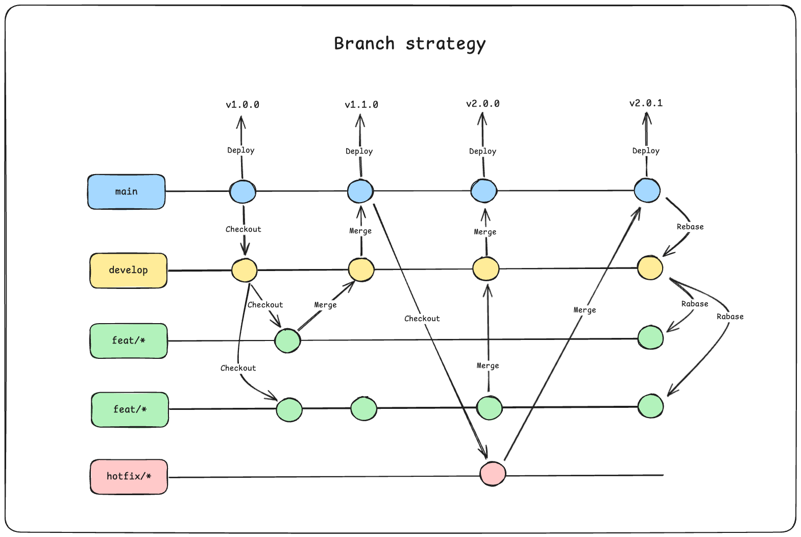
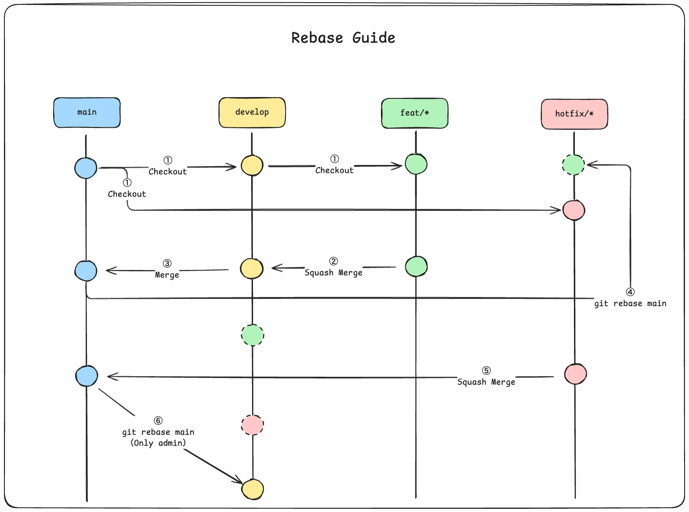

# Branch strategy

This branch strategy is inspired by
[GithubFlow](https://docs.github.com/en/get-started/using-github/github-flow).

**Apart from branch naming**, feel free to structure as you like without any
issues.



## Contents

- [Branches](#Branches)
- [Naming](#naming)
- [Merge Target](#merge-target)
- [Merge Method](#merge-method)
- [Rebase Guide](#things-to-do-before-issuing-a-pull-request)

## Branches

The basic types and roles of branches are as follows.

| Name      | Description                                     | Source               |
| --------- | ----------------------------------------------- | -------------------- |
| main      | Always deployable and stable branch             | None                 |
| develop   | A branch for integrating code under development | main                 |
| `type`/\* | Basic working branch                            | develop or `type`/\* |

It is recommended to divide large working branches into smaller working branches
for each task.

## Naming

Branch naming should follow `<type>/*` to ensure that various workflows function
effectively.

It is recommended to separate the parts after `*` with `-`.

### Example

**GOOD**: `feat/good-case`

**BAD**: `feat/bad/case`

### Valid type

Branches named with the following `type` will automatically be assigned related
labels upon issuing a PullRequest.

- `feat`: 🌱feature
- `enhance` or `enhancement`: ⚒️enhancement
- `improve`: ⚒️enhancement
- `refactor`: ⚒️enhancement
- `fix`: 🐛bug
- `hotfix`: 🐞hotfix
- `docs`: 📝documentation

These behaviors can be modified in
[assign-labels.yml](../.github/workflows/assign-labels.yml) and
[release-drafter.yml](../.github/release-drafter.yml).

## Merge Target

Pay attention to the target branch for merging to prevent trouble, accidents,
and confusion.

| Name      | Merge Target         |
| --------- | -------------------- |
| main      | None                 |
| develop   | main                 |
| `type`/\* | develop or `type`/\* |
| hotfix/\* | main                 |

> [!WARNING]
>
> If the `hotfix` branch is merged directly into `main`, it is recommended to
> synchronize by executing `git rebase main` on the `develop` branch.

## Merge Method

The merge methods for each scenario are as follows.

| Name      | Target    | Method       |
| --------- | --------- | ------------ |
| develop   | main      | Base Merge   |
| `type`/\* | develop   | Squash Merge |
| `type`/\* | `type`/\* | Squash Merge |
| hotfix/\* | main      | Base Merge   |

## Rebase Guide



To maintain a clean commit history and avoid unnecessary merge commits, follow
the steps below based on your branching context.

### Working branch (`type`/\*) -> Working branch (`type`/\*)

1. Execute `git rebase <base_branch>`.
2. Create a Pull Request.
3. **Squash Merge** into `<base_branch>`.
4. Delete the branch.

### Working branch (`type`/\*) -> develop

1. Execute `git rebase develop`.
2. Create a Pull Request.
3. **Squash Merge** into develop.
4. Delete the branch.

### Develop to Main

1. Execute `git rebase main`.
2. Create a Pull Request.
3. **Base Merge** into main.

### Hotfix Branch (`hotfix/*`)

1. Execute `git rebase main`.
2. Create a Pull Request.
3. **Squash Merge** into `main`.
4. Delete the branch.

> [!WARNING]
>
> After a hotfix is merged into `main`, `develop` must be rebased onto `main` to
> sync the changes:
>
> ```bash
> git checkout develop
> git rebase main
> ```

### Important Notes

- Only maintainers/admins should rebase `develop` onto `main` after hotfix
  merges.
- Rebasing should be avoided on shared branches unless all collaborators are
  aware.

This process ensures that the `main` branch remains stable, the `develop` branch
stays up-to-date, and each feature/hotfix has a clear, linear history.
