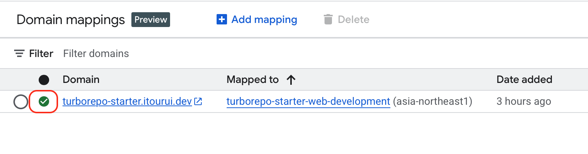

# Mapping Domain

How to map a custom domain to a deployed Cloudrun service.

## Creating a Zone in Cloudflare

1. Access [Cloudflare](https://dash.cloudflare.com/) and create an account.
2. Obtain/purchase a domain.
3. Create a zone.

## Verifying Domain Ownership

1. Verify domain ownership in
   [Search Console](https://search.google.com/search-console).

2. Copy the specified TxT Record value and register it in Cloudflare's DNS
   records.

3. Return to Search Console, press the verify button, and wait for a moment.

## Configuring the Mapping in Cloudrun

1. Select the verified domain on Cloudrun's
   [Mapping domain](https://console.cloud.google.com/run/domains) settings page
   to map it.

> [!NOTE]
>
> Leaving the subdomain field blank will map it to the origin.

Finally, a modal like the following image will appear.

1. Add the records instructed in the modal to Cloudflare.

3. Return to the Mapping Domain page of Cloudrun and wait for the status to be
   completed.

Congratulations! A custom domain has been successfully mapped to the Cloudrun
service!
